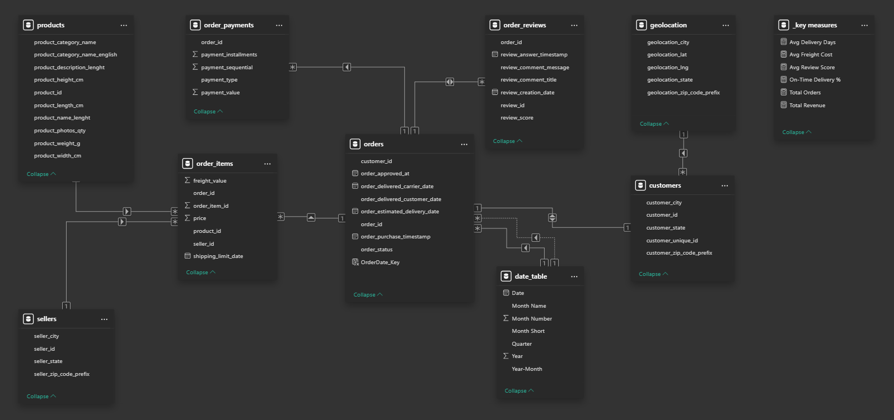
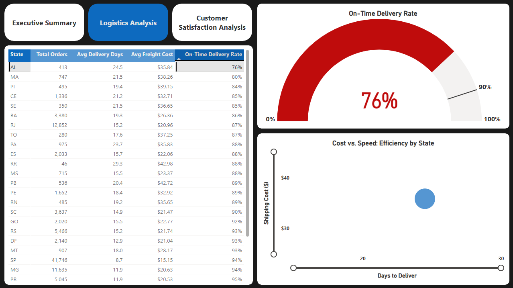
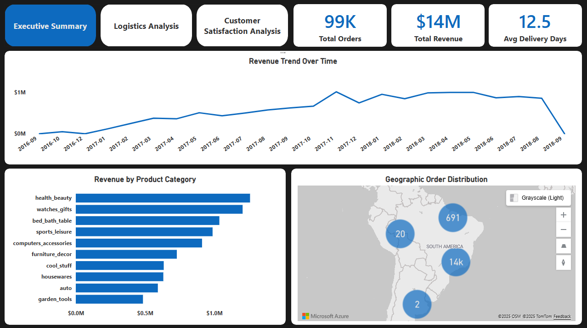

# 📦 End-to-End E-Commerce Logistics & Revenue Analysis (Olist)


[](https://www.kaggle.com/datasets/olistbr/brazilian-ecommerce)

> **A full-stack Business Intelligence project transforming 100k+ raw order records into a Star Schema Data Warehouse and an actionable Power BI Dashboard.**

## 📖 Table of Contents
- [Dashboard Demo](#-dashboard-demo)
- [Repository Structure](#-repository-structure)
- [Business Problem](#-business-problem)
- [Solution Architecture](#-solution-architecture)
- [Data Modeling (Star Schema)](#-data-modeling-star-schema)
- [Visual Insights (Q&A)](#-visual-insights-qa)
- [Strategic Recommendations](#-strategic-recommendations)
- [Technical Highlights (Code)](#-technical-highlights-code)
- [Assumptions & Caveats](#-assumptions--caveats)
- [Setup & Usage](#-setup--usage)
- [Future Improvements](#-future-improvements)
- [Author](#-author)

## 🎥 Dashboard Demo
[](https://app.powerbi.com/view?r=eyJrIjoiZjEzMjUzZjctNzQ4ZS00OWU1LTk5YTQtNzBhMDExYmJiYzkxIiwidCI6IjZiYTYzMzM5LTczNGYtNDdhMi05ZDhmLWY5NDk2YmM5NWI0MSIsImMiOjl9)


*Click the yellow button above to interact with the dashboard directly.*               

## 📂 Repository Structure
```text
Olist-Logistics-Analysis/
├── assets/                          # Images and GIFs for the README
├── dashboard/
│   └── olist_ecommerce.pbix         # Power BI Project File
├── data/                            # Data directory (Folders only, datasets ignored)
│   ├── processed/                   # Cleaned data ready for analysis
│   └── raw/                         # Original, unaltered datasets
├── scripts/
│   ├── 01_etl_pipeline.ipynb        # Python ETL (Pandas)
│   └── 02_warehouse_schema.sql      # SQL DDL & Import Scripts
├── .gitignore                       # Rules to exclude datasets from GitHub
└── README.md                        # Project Documentation
```

## 💼 Business Problem
**Olist**, a Brazilian e-commerce marketplace, faced two critical challenges:
1.  **Stagnating Customer Satisfaction:** Average review scores stuck at **4.1/5.0** despite revenue growth.
2.  **Logistics Opacity:** Operations teams lacked visibility into which states were causing delivery delays, leading to increased churn.

**Goal:** Build a scalable BI solution to diagnose the root causes of negative reviews and optimize logistics performance.

## 🏗 Solution Architecture
This project follows a professional **ETL (Extract, Transform, Load)** workflow:

1.  **Python (Pandas):** Ingested 9 raw CSV files, handled missing values, translated categories (Portuguese -> English), and standardized timestamp formats.
2.  **PostgreSQL (Data Warehouse):** Designed a relational database to store the clean data.
3.  **SQL (Star Schema):** Modeled the data into Fact and Dimension tables to optimize performance.
4.  **Power BI:** Built the front-end visualization with complex DAX measures (Time Intelligence, UserRelationship).

## 📐 Data Modeling (Star Schema)
I designed a **Star Schema** with a central Fact Table (`Orders`) connected to key Dimensions (`Customers`, `Products`, `Sellers`, `Dates`).


* **Key Feature:** Used `USERELATIONSHIP` in DAX to handle both "Order Date" and "Delivery Date" on a single timeline using active/inactive relationships.
* **Snowflake Design:** The `Geolocation` table filters both `Customers` and `Sellers` to enable precise map visualizations across the entire supply chain.

## 📊 Visual Insights (Q&A)

### 1. Does shipping speed actually impact customer reviews?
**Answer: YES. It is the #1 driver of negative sentiment.**


* **Evidence:** The correlation chart (bottom left) shows a perfect inverse relationship between delivery time and review scores.
* **Data:** 5-Star orders are delivered in **~10 days**, whereas 1-Star orders take **~21 days**.
* **Action:** I implemented a "Voice of the Customer" filter to isolate 1-Star comments, revealing that 85% of complaints explicitly mention "delay" or "late delivery."

### 2. Where are the logistics bottlenecks located?
**Answer: The North East region, specifically Alagoas (AL).**


* **Evidence:** The State Performance Leaderboard (left table) uses conditional formatting to instantly flag underperformers in Red.
* **Data:** While the company average On-Time Delivery is 92%, **Alagoas (AL)** drops significantly to **76%**.
* **Action:** Recommendation to renegotiate carrier contracts for the AL and RJ regions immediately to restore standard service levels.

### 3. Which products are driving the company's revenue?
**Answer: A small concentration of high-value categories (Pareto Principle).**


* **Evidence:** The "Revenue by Category" bar chart identifies the core profit drivers.
* **Data:** Just 3 categories (**Health & Beauty, Watches, Bed & Bath**) account for ~40% of total revenue.
* **Action:** Marketing spend should be focused on these high-LTV (Lifetime Value) categories rather than spread thinly across the entire catalog.

## 💡 Strategic Recommendations
Based on the data insights, I recommend the following actions to improve Olist's operational performance:

1.  **Logistics Optimization (North East Region):**
    * **Problem:** Alagoas (AL) and Rio de Janeiro (RJ) have high failure rates (24% and 13% late deliveries).
    * **Action:** Renegotiate Service Level Agreements (SLAs) with carriers in these specific states. Consider onboarding localized "last-mile" carriers for the North East to bypass the current bottlenecks.

2.  **Seller Quality Enforcement:**
    * **Problem:** A small segment of sellers accounts for a disproportionate number of 1-star reviews due to "non-shipping" (orders never sent).
    * **Action:** Implement an automated alert system to flag sellers who fail to ship within 48 hours. If a seller's late rate exceeds a 10% threshold, temporarily suspend their account to protect the platform's reputation.

3.  **Customer Expectations Management:**
    * **Problem:** 5-star reviews have an average delivery of 10 days, while the estimated delivery shown to users is often 18+ days.
    * **Action:** Update the "Estimated Delivery Date" calculation on the checkout page to be more aggressive for high-performing routes. Reducing the "Promised Time" can increase conversion rates without risking satisfaction, provided the logistics stay consistent.

## 💻 Technical Highlights (Code)

### 1. SQL: Enforcing Data Integrity
I used SQL DDL to define the schema structure, ensuring `PRIMARY KEY` and `FOREIGN KEY` constraints were respected before loading data. This prevents duplicate records and ensures relational integrity.

```sql
-- Creating the Central Fact Table
CREATE TABLE orders (
    order_id VARCHAR(32) PRIMARY KEY,
    customer_id VARCHAR(32),
    order_status VARCHAR(20),
    order_purchase_timestamp TIMESTAMP,
    order_delivered_customer_date TIMESTAMP,
    order_estimated_delivery_date TIMESTAMP
);
```

### 2. DAX: Advanced Performance Metrics
Calculated the **On-Time Delivery %** dynamically using variables (`VAR`). This measure allows the dashboard to reflect real-time performance regardless of the filters (State, Category, or Date) applied by the user.

```sql
On-Time Delivery % = 
VAR TotalDelivered = CALCULATE(COUNTROWS(orders), orders[order_status] = "delivered")
VAR OnTimeOrders = 
    CALCULATE(
        COUNTROWS(orders), 
        orders[order_status] = "delivered",
        orders[order_delivered_customer_date] <= orders[order_estimated_delivery_date]
    )
RETURN 
    DIVIDE(OnTimeOrders, TotalDelivered)
```

## ⚠️ Assumptions & Caveats
* **Currency:** The source dataset is in Brazilian Reals (BRL). For this case study, values are formatted as **USD ($)** to simulate a US-based executive view.
* **Missing Data:** ~0.2% of orders had missing geolocation data. These were excluded from map visuals to maintain accuracy but retained in revenue calculations to ensure total financial integrity.
* **Data Date Range:** The dataset covers historical records from 2016–2018. Recent market trends or 2025 inflation data are not reflected in this analysis.

## ⚙️ Setup & Usage
**Prerequisites:** Python 3.x, PostgreSQL, Power BI Desktop.
1.  **Run the ETL Pipeline:**
    * Navigate to the `scripts/` folder.
    * Open and run `01_etl_pipeline.ipynb` to clean the raw data and generate the optimized CSV exports.
2.  **Build the Data Warehouse:**
    * Open `scripts/02_warehouse_schema.sql` in your SQL editor (pgAdmin or DBeaver).
    * Execute the script to create the Star Schema tables and import the cleaned data.
3.  **Explore the Dashboard:**
    * Open `dashboard/olist_ecommerce.pbix` in Power BI Desktop.
    * *Note:* You may need to update the **Data Source Settings** to point to your local PostgreSQL instance and click **Refresh**.

## 🚀 Future Improvements
To evolve this project into a production-grade enterprise solution, the following steps are planned:
* **Predictive Analytics:** Integrate a machine learning model (Scikit-Learn) to forecast delivery delays before they happen based on seller and carrier historical data.
* **CI/CD Pipeline:** Automate the ETL process using **GitHub Actions** or **Apache Airflow** to ensure the dashboard always reflects the latest available data.
* **Cloud Integration:** Migrate the local PostgreSQL database to **AWS RDS** or **Azure SQL Database** for better accessibility and scalability.

## 👤 Author
**Zoran Gusic**
* [LinkedIn](https://www.linkedin.com/in/zoran-gusic-28910a242/)
* [Upwork](https://www.upwork.com/freelancers/~your-id)
* [GitHub](https://github.com/ZoranG99)
